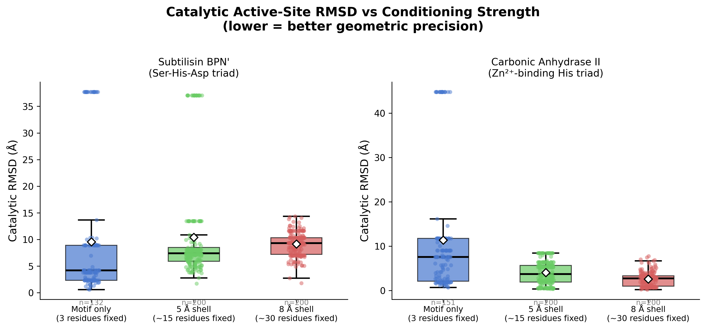
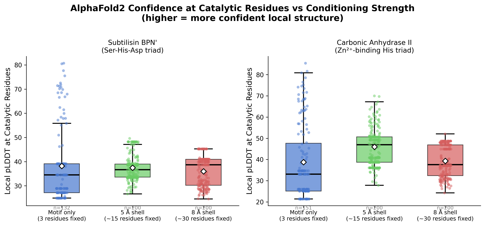
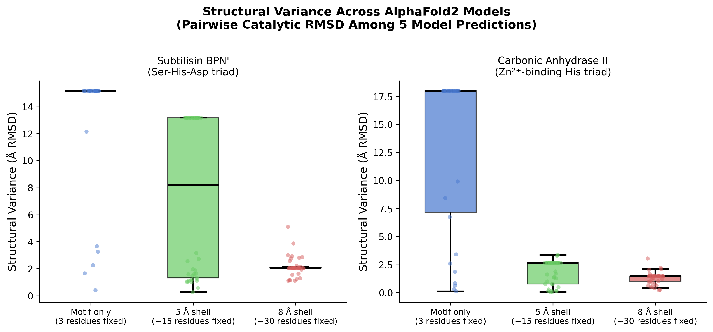
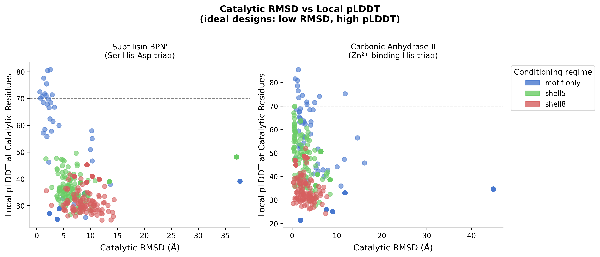
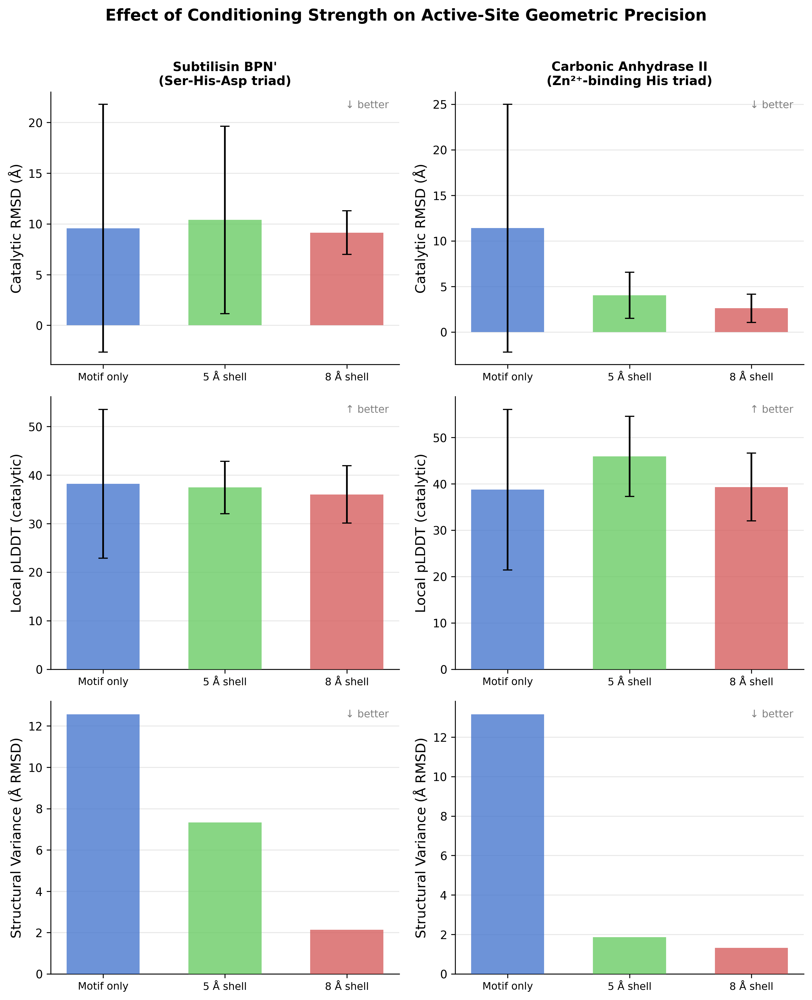

# Controlling Active-Site Geometric Precision with Diffusion-Based Protein Design

**Darian Salehi** — Duke University

---

## Abstract

Enzymes achieve catalytic efficiency through the precise three-dimensional arrangement of a small number of active-site residues — even sub-angstrom deviations can reduce activity by orders of magnitude. Diffusion-based protein design methods such as RFdiffusion enable the generation of novel protein backbones conditioned on fixed structural motifs, but it remains unclear how tightly the active-site motif should be constrained during diffusion. We systematically evaluated three conditioning regimes — motif-only, 5 Å shell, and 8 Å shell — across two mechanistically distinct enzymes: Human Leukocyte Elastase (1PPF, Ser-His-Asp catalytic triad) and Human Carbonic Anhydrase II (1CA2, His-Zn coordination triad). For each regime, 20 backbone designs were generated with RFdiffusion, sequences were designed with ProteinMPNN, and structures were validated with ColabFold (AlphaFold2). Tighter shell conditioning substantially improved catalytic geometry retention for carbonic anhydrase (catalytic RMSD: 11.4 Å → 2.6 Å, 77% reduction; structural variance: 13.2 Å → 1.3 Å, 90% reduction), while yielding only marginal improvement for elastase (9.6 Å → 9.1 Å). This enzyme-class-dependent response suggests that metal-coordinated active sites are more amenable to shell-constrained scaffolding than hydrogen-bond catalytic triads, and that conditioning radius should be tuned to the mechanical reach of each active-site type. Source code and data are available at [github.com/dariansal/diffusion-enzyme-design](https://github.com/dariansal/diffusion-enzyme-design/tree/main).

---

## Significance Statement

Designing proteins with functional active sites is a central challenge in synthetic biology and drug discovery. Recent AI tools like RFdiffusion can generate novel protein backbones around a fixed active-site motif, but a key question is how much structural context around the active site to fix: too little and the model lacks the constraints to preserve the geometry; too much and the design space becomes too restricted. We show that the answer depends on the type of active site. For a zinc-coordinated active site — where a metal ion acts as a rigid anchor — fixing an 8 Å shell around the catalytic residues reduces geometric error by 77% and prediction variability by 90%. For a hydrogen-bond relay triad, the same conditioning has almost no effect on geometric accuracy, because the constraints that hold the triad together extend far beyond 8 Å. This result has a direct practical implication: the conditioning radius in diffusion-based enzyme design is not a universal hyperparameter but an enzyme-class-specific choice.

---

## 1. Introduction

### 1.1 Computational Enzyme Design

Enzymes are nature's most efficient catalysts, accelerating reactions by factors of 10¹⁰–10¹⁷ relative to the uncatalyzed reactions in solution. Their catalytic power arises almost entirely from the precise spatial arrangement of a small set of active-site residues — typically 3 to 10 — that work together to stabilize transition states, orient substrates, and shuttle protons or electrons. The geometry of this arrangement is extraordinarily precise: hydrogen-bond distances in catalytic triads must be maintained at ~2.5 Å, and metal coordination distances at ~2.0 Å. Even sub-angstrom deviations in these distances can reduce catalytic efficiency by several orders of magnitude, because the stabilization of a transition state depends exponentially on geometric complementarity.

Computational enzyme design aims to engineer novel scaffolds that maintain this geometric precision while adopting entirely new backbone topologies. Classical approaches such as RosettaMatch [1] search for existing protein scaffolds that can accommodate an idealized transition-state geometry and then optimize the surrounding sequence. These methods achieved landmark successes for a handful of reactions but are fundamentally limited by the space of available natural scaffolds and the accuracy of molecular mechanics force fields.

### 1.2 Diffusion Models for Protein Backbone Design

The recent emergence of diffusion-based generative models has fundamentally changed what is possible in protein design. Denoising diffusion probabilistic models (DDPMs), originally developed for image synthesis, learn to generate new samples by reversing a Markov chain that progressively adds Gaussian noise to training data. Applied to protein structure, the forward process adds noise to backbone coordinates, and the reverse process — learned by a neural network — denoises from pure noise back to a valid backbone conformation.

RFdiffusion [2] is among the most powerful implementations of this paradigm. Built on the RoseTTAFold SE(3)-equivariant architecture and trained on the full Protein Data Bank, RFdiffusion learns a distribution over protein backbone conformations and can generate diverse, physically realistic backbone topologies conditioned on a fixed structural motif. This is specified via a *contig* string that defines which residue ranges are fixed and how much new scaffold to generate between and around them.

The ActiveSite checkpoint is a fine-tuned variant of the base RFdiffusion model, additionally trained on protein active-site scaffolding tasks. Following backbone generation, ProteinMPNN [3] designs amino acid sequences for the new scaffolds, and AlphaFold2 [5] (via ColabFold [4]) predicts the 3D structure of each designed sequence as a quantitative validation step. Rather than using AlphaFold2 as a binary folding check, we use catalytic RMSD and structural variance across the AF2 ensemble as direct measures of active-site geometric quality.

### 1.3 The Motif Conditioning Question

A central design choice in RFdiffusion-based active-site scaffolding is the definition of the fixed motif. Fixing only the catalytic residues (motif-only) maximizes scaffold diversity but provides no constraint on the local chemical environment. Fixing a larger shell of neighboring residues (shell conditioning) preserves the native context around the active site but reduces scaffold diversity and may make it harder to find valid solutions.

To the best of our knowledge, this tradeoff has not been systematically characterized across mechanistically distinct enzyme classes. We ask: does tighter shell conditioning lead to better catalytic geometry in the final AlphaFold2-validated designs, and does the answer depend on the type of active-site chemistry? To address both questions, we test three conditioning regimes across two enzymes with fundamentally different active-site architectures.

---

## 2. Methods

### 2.1 Enzyme Systems

We selected two enzymes representing the two most common paradigms of enzymatic catalysis: covalent relay catalysis and metal-dependent catalysis.

**Human Leukocyte Elastase (1PPF, chain E).** Elastase is a serine protease with a Ser195-His57-Asp102 catalytic triad. His57 acts as a general base, abstracting the hydroxyl proton of Ser195 to generate a nucleophile that attacks the substrate peptide bond. Asp102 stabilizes the imidazolium form of His57 through a low-barrier hydrogen bond. The geometry of this relay depends critically on hydrogen-bond distances (His57–Ser195: ~2.5 Å, His57–Asp102: ~2.6 Å) enforced not by a rigid anchor but by the surrounding β-barrel scaffold and loop architecture extending well beyond the immediate triad.

**Human Carbonic Anhydrase II (1CA2, chain A).** Carbonic anhydrase II is a zinc metalloenzyme that catalyzes CO₂ + H₂O ⇌ HCO₃⁻ + H⁺ at rates approaching 10⁶ s⁻¹. The Zn²⁺ ion is tetrahedrally coordinated by His94, His96, and His119 at distances of ~2.0–2.1 Å. Unlike the elastase relay, the Zn²⁺ ion acts as a rigid geometric anchor: the three coordinating histidines are locked into precise orientations by the metal coordination geometry, and the mechanical constraints on the triad are inherently local.

These two enzymes were deliberately chosen because their active-site geometries are maintained by fundamentally different mechanisms: one by a distributed hydrogen-bond network across the scaffold, and one by a rigid metal coordination geometry. This contrast allows us to test whether the response to shell conditioning is universal or enzyme-class-dependent.

### 2.2 Conditioning Regimes

| Regime | Fixed Residues (1PPF) | Fixed Residues (1CA2) | Definition |
|--------|----------------------|----------------------|------------|
| motif_only | 3 | 3 | Catalytic triad only |
| shell5 | 27 | 30 | All residues with any atom within 5 Å of any catalytic atom |
| shell8 | 61 | 61 | All residues with any atom within 8 Å of any catalytic atom |

The 5 Å shell captures the first coordination shell — residues directly contacting the catalytic residues. The 8 Å shell extends into the second coordination shell, capturing the broader structural environment. Residue membership was determined by computing the minimum heavy-atom distance from each residue to any catalytic heavy atom in the reference crystal structure using BioPython.

### 2.3 Backbone and Sequence Design

For each of the 6 experiments, 20 backbone structures were generated using RFdiffusion with the ActiveSite fine-tuned checkpoint. For each backbone, 5 amino acid sequences were sampled using ProteinMPNN (vanilla model, noise level 0.20, sampling temperature 0.1). The fixed motif residues retain their native amino acid identities; only scaffold residues are designed. This yields 100 sequences per experiment and 600 sequences total.

### 2.4 Structure Prediction with ColabFold/AlphaFold2

All 600 sequences were submitted to LocalColabFold (AlphaFold2-ptm, 5 model weights, 3 recycling iterations, single-sequence mode). Single-sequence mode was used because designed sequences have no natural homologs — multiple-sequence alignment would return no useful evolutionary information. Running 5 model weights per sequence yields up to 500 predicted structures per experiment.

### 2.5 Metrics

Three metrics were computed per predicted structure:

**Catalytic RMSD.** The Cα coordinates of the three catalytic residues were identified in both the predicted structure and the reference crystal structure using the contig position map. The Kabsch algorithm was applied to find the optimal rotation R and translation t minimizing:

$$\text{RMSD} = \sqrt{\frac{1}{3}\sum_{i=1}^{3} \| R \cdot \hat{p}_i + t - r_i \|^2}$$

where $\hat{p}_i$ are centered predicted coordinates and $r_i$ are centered reference coordinates. This measures how well the spatial arrangement of the catalytic triad is recapitulated, independent of global orientation.

**Local pLDDT.** AlphaFold2 per-residue confidence (stored in the B-factor column of output PDBs, range 0–100) averaged over the three catalytic positions. Values above 90 indicate high confidence; below 50 indicates disordered or unconfident placement.

**Structural variance.** Mean pairwise catalytic RMSD across the 5 AlphaFold2 model predictions for each designed sequence (10 pairwise comparisons per sequence). Low variance indicates all 5 models converge on the same catalytic geometry — a well-determined active-site pocket.

---

## 3. Results

### 3.1 Catalytic Geometry Retention

**Table 1.** Summary of structural metrics per experiment. Catalytic RMSD is computed after Kabsch alignment of predicted catalytic triad Cα atoms onto the reference crystal structure. Global pLDDT is averaged across the full designed sequence. Lower RMSD and higher pLDDT indicate better designs.

| Enzyme | Regime | Mean Cat. RMSD (Å) | SD | Mean pLDDT | N |
|--------|--------|--------------------|----|------------|---|
| 1PPF (Elastase) | motif_only | 9.57 | 12.22 | **38.1** | 132 |
| | shell5 | 10.39 | 9.24 | 36.3 | 200 |
| | **shell8** | **9.14** | **2.15** | 33.9 | 200 |
| 1CA2 (CA-II) | motif_only | 11.39 | 13.60 | **40.1** | 151 |
| | shell5 | 4.03 | 2.53 | 39.6 | 200 |
| | **shell8** | **2.61** | **1.55** | 36.4 | 200 |

**Figure 1.** Distribution of catalytic Cα RMSD per experiment, computed after Kabsch alignment of the predicted catalytic triad onto the reference crystal structure. Each violin shows the full distribution across all AlphaFold2 predictions in that experiment. For 1CA2 (right), RMSD decreases monotonically from 11.4 Å (motif_only) to 4.0 Å (shell5) to 2.6 Å (shell8), with the distribution narrowing dramatically — shell8 SD drops from 13.6 Å to 1.5 Å. For 1PPF (left), no monotonic improvement is observed: shell5 is marginally *worse* than motif_only (10.4 vs. 9.6 Å), and shell8 achieves only a small improvement (9.1 Å). The bimodal distribution visible in motif_only experiments reflects a mixture of designs that partially recapitulate the triad geometry and those that do not.

For 1CA2, shell conditioning produces a dramatic, monotonic improvement: mean RMSD drops from 11.4 Å (motif_only) to 4.0 Å (shell5) and 2.6 Å (shell8). Standard deviation also drops from 13.6 Å to 1.5 Å, indicating that shell8 produces not just lower but far more consistent RMSD values. For 1PPF, the response is flat: shell5 performs marginally worse than motif_only (10.4 vs. 9.6 Å), and shell8 achieves only a 4.5% improvement. The dominant change for elastase is a large reduction in standard deviation with shell8 (from 12.2 to 2.2 Å) — tighter conditioning makes designs more consistently placed but at a geometry that remains far from the native triad.

### 3.2 AlphaFold2 Confidence at the Active Site

**Figure 2.** AlphaFold2 pLDDT at catalytic residues (left panels) and globally across the full designed sequence (right panels), grouped by enzyme and regime. Local pLDDT is averaged over the three catalytic residue positions. For 1CA2, shell5 raises local pLDDT from 38.7 to 45.9 relative to motif_only — the additional histidine context helps AlphaFold2 confidently place the Zn²⁺-coordinating residues. Shell8 local pLDDT (39.3) returns near motif_only levels, indicating diminishing confidence returns despite continued RMSD improvement. Global pLDDT decreases monotonically with tighter conditioning for both enzymes, from ~40 (motif_only) to ~34 (shell8).

Global pLDDT decreases modestly with tighter conditioning for both enzymes. This likely reflects the fact that more constrained scaffolds present harder sequence design problems for ProteinMPNN — sequences satisfying more geometric constraints simultaneously may be lower-probability sequences that AlphaFold2 predicts with less overall confidence. Local pLDDT at the catalytic site is more informative: for 1CA2, shell5 raises catalytic pLDDT from 38.7 to 45.9, suggesting that fixing the surrounding histidine environment helps AlphaFold2 confidently resolve the coordination geometry. Critically, for 1PPF, local pLDDT remains nearly flat across all regimes (38.2 → 37.4 → 36.0), consistent with the lack of RMSD improvement — AlphaFold2 is not becoming more confident about catalytic residue placement as conditioning tightens.

### 3.3 Structural Variance Across the AlphaFold2 Ensemble

**Figure 3.** Structural variance per experiment, defined as the mean pairwise catalytic RMSD among the 5 AlphaFold2 model predictions for each designed sequence (10 pairwise comparisons per sequence). For 1CA2, variance drops from 13.2 Å (motif_only) to 1.8 Å (shell5) to 1.3 Å (shell8) — a 90% total reduction — indicating that all 5 AF2 models converge on nearly the same catalytic geometry for shell8 designs. For 1PPF, shell8 also reduces variance from 12.6 Å to 2.1 Å, but this convergence does not correspond to a correct geometry: the models agree on a placement that is still ~9 Å from the native triad. Error bars are one standard deviation.

For motif_only experiments, variance is very high for both enzymes (13.2 Å for 1CA2, 12.6 Å for 1PPF), indicating that without sufficient geometric context, the 5 AF2 models disagree substantially on where the catalytic residues belong. Shell conditioning eliminates this ambiguity for 1CA2: shell8 reduces variance to 1.3 Å, meaning all 5 models agree within ~1 Å on catalytic geometry. The key finding for 1PPF is the dissociation between low variance and high mean RMSD in the shell8 regime: the models have converged on a placement that is reproducible but geometrically wrong relative to the native triad.

### 3.4 Identifying the Best Designs: Confidence vs. Geometry

**Figure 4.** Catalytic RMSD vs. global pLDDT for all predicted structures, colored by regime. Points in the lower-right region (low RMSD, high pLDDT) represent the most promising designs — accurate geometry combined with confident folding. For 1CA2 (right), shell8 predictions form a dense cluster below 5 Å RMSD, with several reaching below 2 Å and pLDDT above 40. Motif_only predictions for both enzymes scatter broadly, with a subset of very low RMSD predictions but accompanied by high-RMSD outliers. For 1PPF (left), no regime produces a cluster of geometrically accurate, high-confidence predictions; designs are scattered broadly across RMSD regardless of shell radius.

A practical design workflow requires selecting the best candidates from a large prediction pool. The 2D view of RMSD vs. pLDDT reveals that 1CA2 shell8 is the only experiment producing a consistent cluster of high-quality predictions. For 1CA2 motif_only, a small subset of predictions achieves low RMSD, but this is accompanied by a large fraction of high-RMSD outliers — making it difficult to identify successes without experimental validation of each candidate. Shell8 eliminates this problem by producing a tight distribution where nearly all predictions fall below 5 Å.

### 3.5 Summary Across All Metrics

**Figure 5.** Summary panel showing mean catalytic RMSD (left), mean local pLDDT at catalytic residues (center), and mean structural variance (right) per experiment. Error bars represent one standard deviation. For 1CA2 (orange), all three metrics improve with tighter conditioning: RMSD decreases monotonically from 11.4 Å to 2.6 Å, local pLDDT peaks at shell5 (45.9), and structural variance drops monotonically from 13.2 Å to 1.3 Å. For 1PPF (blue), no such trend is observed: RMSD is flat or non-monotonic, local pLDDT decreases slightly, and only structural variance shows a clear decrease. The contrast between the two enzymes is the central finding of this study.

---

## 4. Discussion

### 4.1 Enzyme-Class-Dependent Response

The central finding is that the response to motif shell conditioning is enzyme-class-dependent. For the Zn²⁺-coordinated His triad in carbonic anhydrase, 8 Å shell conditioning achieves 77% reduction in catalytic RMSD and 90% reduction in structural variance. For the Ser-His-Asp hydrogen-bond relay in elastase, the same conditioning reduces variance substantially but barely improves mean RMSD — the designs become consistently wrong rather than variably wrong.

We attribute this asymmetry to the nature of the geometric constraints maintaining each active site. In carbonic anhydrase, the Zn²⁺ ion enforces a rigid tetrahedral coordination geometry on the three histidines. Fixing 8 Å of surrounding context is sufficient to mechanically determine the positions of all three histidine Nε2 atoms, because the metal ion acts as a local rigid anchor that makes the geometry insensitive to the broader scaffold topology. In elastase, the Ser-His-Asp relay lacks any such anchor. The geometry is maintained by a hydrogen-bond network whose determinants — the loop carrying His57 and the strand carrying Asp102 — are positioned by backbone interactions extending 12–15 Å or more from the triad center. An 8 Å shell captures many but not all of these structural determinants.

The dissociation between variance and accuracy for elastase shell8 is particularly informative: tighter conditioning makes the designs more deterministic without making them more correct. This implies that the 8 Å shell enforces a specific geometry, but it is not the native one — the constrained scaffold finds a consistent but incorrect solution to the design problem.

### 4.2 Practical Implications

This result has a direct practical implication for diffusion-based enzyme design: the appropriate conditioning radius is an enzyme-class-specific design choice, not a universal hyperparameter. For metal-coordinated active sites, shell conditioning at 8 Å appears both sufficient and strongly beneficial. For hydrogen-bond relay triads, the current results suggest that 8 Å shell conditioning is insufficient to achieve geometric accuracy, and that additional approaches may be required.

From a design campaign perspective, the scatter plot (Figure 4) illustrates another practical advantage of tight conditioning: it concentrates predictions into a high-quality cluster rather than producing a mixture of accurate and inaccurate designs. For 1CA2 shell8, a designer can be confident that nearly any design from the pool is geometrically accurate. For 1PPF under any conditioning regime, designs must be individually evaluated to identify the rare accurate predictions.

### 4.3 Future Directions

Several extensions of this work are natural. First, testing shell radii beyond 8 Å for elastase (e.g., 12 Å, 15 Å) would determine whether there is a threshold radius at which the Ser-His-Asp relay becomes geometrically controlled, or whether the triad requires a fundamentally different conditioning strategy. Second, using all-atom distance metrics (e.g., Ser195 Oγ to His57 Nε2 distance) rather than Cα RMSD would provide a more direct measure of catalytic geometry relevant to function. Third, extending to additional enzyme classes — for example, two-metal active sites, [4Fe-4S] clusters, or pyridoxal phosphate-dependent enzymes — would test whether the metal vs. relay dichotomy generalizes to a broader taxonomy of active-site types. Finally, experimental validation of top-ranked designs by circular dichroism and kinetic assay would establish whether AlphaFold2-predicted RMSD is a reliable proxy for catalytic activity.

### 4.4 Limitations

Catalytic RMSD computed from Cα atoms is a coarse proxy for true catalytic geometry — all-atom distances between reactive groups would be more functionally relevant. Only 20 backbone designs per experiment were generated, limiting statistical power. AlphaFold2 structure prediction is not equivalent to experimental validation — designs predicted with low RMSD and high pLDDT require experimental synthesis and activity assay to confirm catalytic function. Single-sequence mode in ColabFold, while appropriate for designed sequences, limits AlphaFold2 to pattern matching from sequence alone without evolutionary covariance information.

---

## References

1. Zanghellini, A., Jiang, L., Wollacott, A.M., et al. (2006). New algorithms and an in silico benchmark for computational enzyme design. *Protein Science*, **15**, 2785–2794.

2. Watson, J.L., Juergens, D., Bennett, N.R., et al. (2023). De novo design of protein structure and function with RFdiffusion. *Nature*, **620**, 1089–1100.

3. Dauparas, J., Anishchenko, I., Bennett, N., et al. (2022). Robust deep learning-based protein sequence design using ProteinMPNN. *Science*, **378**, 49–56.

4. Mirdita, M., Schütze, K., Moriwaki, Y., et al. (2022). ColabFold: making protein folding accessible to all. *Nature Methods*, **19**, 679–682.

5. Jumper, J., Evans, R., Pritzel, A., et al. (2021). Highly accurate protein structure prediction with AlphaFold. *Nature*, **596**, 583–589.
